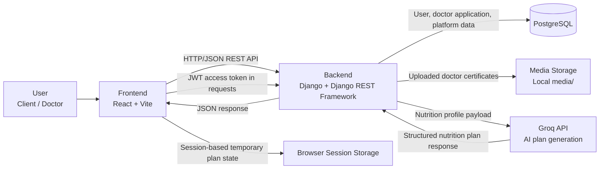

# 1. Design System Architecture

## High-Level Architecture Diagram

---

## Data Flow

### 1. Authentication Flow

* The user interacts with the React frontend to register or log in.
* The frontend sends authentication requests to the Django REST backend.
* The backend validates credentials and returns JWT tokens.
* The frontend stores the authentication data locally and attaches the access token to protected API requests.

---

### 2. Role-Based Application Flow

* After login, the frontend routes the user based on role (`client` or `doctor`).
* Protected client and doctor pages communicate with the backend through authenticated REST endpoints.

---

### 3. AI Nutrition Plan Flow

* The client completes the multi-step questionnaire in the React frontend.
* The frontend normalizes the questionnaire answers and sends them to the backend AI Plans endpoint.
* The Django backend validates the submitted nutrition profile.
* The backend sends the profile to the **Groq API** for nutrition plan generation.
* Groq returns a structured plan to the backend.
* The backend returns the generated plan to the frontend.
* The frontend displays the plan and stores the current session state in browser session storage.
* Simple refinements such as:

  * replacing meals
  * replacing ingredients
  * increasing variety
  * making meals quicker or cheaper
    are handled locally in the frontend without sending another AI request.

---

### 4. Doctor Application Flow

* A doctor fills in the join form and uploads a certificate file from the frontend.
* The frontend sends a multipart form request to the Django backend.
* The backend stores application data in PostgreSQL and stores the uploaded certificate in local media storage.
* The doctor can later retrieve the current application status through the backend API.

---

### 5. Medical Support Flow

* A client opens the Medical Support page in the frontend.
* The frontend requests the approved doctors list from the backend.
* The backend queries PostgreSQL and returns approved doctor records.
* The frontend displays doctor contact information to the client.

---

## Architecture Summary

* **Front-end:** React with Vite
* **Back-end:** Django + Django REST Framework
* **Authentication:** JWT via `rest_framework_simplejwt`
* **Database:** PostgreSQL
* **External Service:** Groq API for AI nutrition plan generation
* **File Storage:** Local media storage for uploaded doctor certificates
* **Client-Side Temporary State:** Browser session storage for questionnaire and generated plan session
