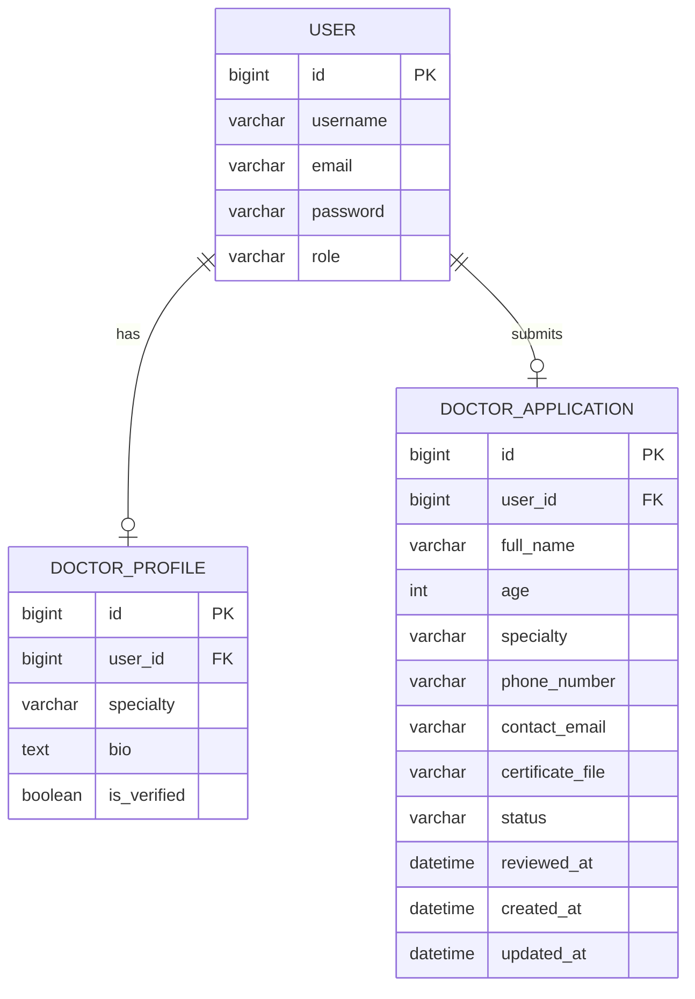

# 2. Define Components, Classes, and Database Design

## Back-End Component and Class Descriptions

### 1. User Model

* **Purpose:** Represents authenticated platform users.

* **Class:** `User`

* **Base Class:** `AbstractUser`

* **Attributes:**

  * `id`
  * `username`
  * `email`
  * `password`
  * `role` (`client` or `doctor`)

* **Key Behavior:**

  * Supports role-based access across the platform.

---

### 2. Doctor Profile Model

* **Purpose:** Stores extended doctor profile information.

* **Class:** `DoctorProfile`

* **Attributes:**

  * `id`
  * `user` (One-to-One with `User`)
  * `specialty`
  * `bio`
  * `is_verified`

* **Key Behavior:**

  * Intended to represent a verified doctor profile.

* **Note:**

  * This model exists in the backend but is not currently used by the active doctor application flow.

---

### 3. Doctor Application Model

* **Purpose:** Stores doctor onboarding requests submitted through the platform.

* **Class:** `DoctorApplication`

* **Attributes:**

  * `id`
  * `user` (One-to-One with `User`)
  * `full_name`
  * `age`
  * `specialty`
  * `phone_number`
  * `contact_email`
  * `certificate_file`
  * `status` (`pending`, `approved`, `rejected`)
  * `reviewed_at`
  * `created_at`
  * `updated_at`

* **Key Behavior:**

  * Tracks the doctor verification lifecycle.

---

## Back-End API and Service Classes

### 4. RegisterView

* **Purpose:** Handles user registration.
* **Methods:**

  * `post()` creates a new user through `UserSerializer`.

---

### 5. LoginView

* **Purpose:** Authenticates users and returns JWT tokens.
* **Methods:**

  * `post()` validates credentials and returns `access`, `refresh`, and basic user data.

---

### 6. CurrentUserView

* **Purpose:** Returns the currently authenticated user.
* **Methods:**

  * `get_object()` returns `request.user`.

---

### 7. DoctorApplicationView

* **Purpose:** Handles doctor application submission and retrieval.

* **Methods:**

  * `get_queryset()` returns the current user’s application
  * `get()` fetches the current application
  * `post()` creates a new application with uploaded certificate

---

### 8. ApprovedDoctorListView

* **Purpose:** Lists approved doctors for clients.
* **Methods:**

  * `get_queryset()` returns doctor applications with `status='approved'`

---

### 9. GenerateAiPlanView

* **Purpose:** Accepts a normalized nutrition profile and returns an AI-generated nutrition plan.

* **Methods:**

  * `post()` validates input, checks API key availability, requests a plan from Groq, validates the returned plan, and sends it back to the client

---

### 10. Permission Classes

* **`IsDoctorUser`**

  * Restricts access to authenticated users with role `doctor`

* **`IsClientUser`**

  * Restricts access to authenticated users with role `client`

---

## Back-End Serializers

### 11. UserSerializer

* **Purpose:** Validates and creates users.
* **Fields:** `id`, `username`, `email`, `password`, `role`
* **Key Method:** `create()`

---

### 12. CurrentUserSerializer

* **Purpose:** Returns authenticated user profile data.
* **Fields:** `id`, `username`, `email`, `role`

---

### 13. DoctorApplicationSerializer

* **Purpose:** Validates and serializes doctor application records.
* **Fields:** application fields plus `certificate_file_url`
* **Key Method:** `get_certificate_file_url()`

---

### 14. ApprovedDoctorSerializer

* **Purpose:** Returns approved doctor data to clients.
* **Fields:** `id`, `username`, `full_name`, `specialty`, `phone_number`, `contact_email`

---

## Back-End AI Service Functions

### 15. `request_nutrition_plan(profile)`

* Sends the normalized client profile to the Groq API and returns a validated JSON nutrition plan.

### 16. `build_system_prompt()`

* Builds the system-level prompt that defines the expected nutrition plan JSON structure.

### 17. `build_user_prompt(profile)`

* Builds the user prompt using the submitted client profile.

### 18. `validate_normalized_profile(profile)`

* Ensures the incoming AI profile payload contains all required sections and key fields.

### 19. `validate_generated_plan(plan)`

* Ensures the generated plan includes required keys and at least one day.

### 20. `hydrate_generated_plan(plan)`

* Adds optional plan fields such as:

  * `shopping_list`
  * `plan_tags`
  * `fallback_message`
    if missing.

---

## Front-End Main Components and Interactions

### 1. AuthProvider / AuthContext

* Manages authentication state, session restoration, login, logout, and registration.
* Interacts with auth services and browser storage.

---

### 2. AppRoutes

* Defines application navigation.
* Routes users into public, client, and doctor sections.

---

### 3. ProtectedRoute / GuestRoute

* Enforces route access control based on authentication and role.

---

### 4. DashboardShell

* Shared dashboard layout for protected areas.
* Hosts sidebar navigation, workspace area, and sign-out controls.

---

### 5. LoginScreen

* Collects username and password.
* Calls authentication logic and redirects by role.

---

### 6. RegisterScreen

* Collects account data and selected role.
* Creates a new client or doctor account.

---

### 7. AiPlansWorkspace

* Main orchestration component for the client AI plan journey.

* Maintains:

  * questionnaire answers
  * current step
  * generated plan
  * validation state
  * local plan edits

* Interacts with:

  * `AiPlanQuestionnaire`
  * `NutritionPlanView`
  * AI plan service
  * local validation utilities
  * session storage

---

### 8. AiPlanQuestionnaire

* Renders the multi-step nutrition intake form dynamically from configuration.
* Sends input updates and navigation actions back to `AiPlansWorkspace`.

---

### 9. NutritionPlanView

* Displays generated nutrition plan data:

  * daily calories
  * macros
  * meals
  * substitutions
  * shopping list
  * plan tags

* Triggers local plan-editing actions without another backend call.

---

### 10. DoctorJoinPage

* Displays doctor application form or submitted application status.
* Uploads certificate files through multipart requests.

---

### 11. ClientMedicalSupportPage

* Fetches and displays approved doctors from the backend.

---

### 12. ClientPlansHistoryPage

* Displays a lightweight history view.
* Currently uses static sample data on the front end rather than persisted backend records.

---

## Database Design

The project uses a **relational database (PostgreSQL)**.

---

### Entity Relationship Diagram



---

## Relational Schema

### Table: `users_user`

* `id` – Primary key
* `username` – Required
* `email` – Required in current registration flow
* `password` – Required
* `role` – Required, default is `client`

---

### Table: `users_doctorprofile`

* `id` – Primary key
* `user_id` – One-to-one foreign key to `users_user`
* `specialty` – Required
* `bio` – Required
* `is_verified` – Default `false`

---

### Table: `users_doctorapplication`

* `id` – Primary key
* `user_id` – One-to-one foreign key to `users_user`
* `full_name` – Required
* `age` – Required
* `specialty` – Required
* `phone_number` – Required
* `contact_email` – Required
* `certificate_file` – Required
* `status` – Default `pending`
* `reviewed_at` – Optional
* `created_at` – Auto-generated
* `updated_at` – Auto-generated

---

## Non-Persistent AI Plan Data Structure

The generated nutrition plan is **not currently stored in the database**. It is returned from the backend and handled in the frontend session.

---

### Normalized AI Profile Payload

```json
{
  "profile": {},
  "goal": {},
  "activity": {},
  "health": {},
  "preferences": {},
  "behavior": {},
  "output_preferences": {}
}
```


### Generated Nutrition Plan Structure

```json
{
  "summary": {
    "daily_calories": 0,
    "daily_macros": {
      "protein_g": 0,
      "carbs_g": 0,
      "fat_g": 0
    },
    "plan_goal": "string"
  },
  "days": [],
  "shopping_list": [],
  "plan_tags": [],
  "fallback_message": ""
}
```
