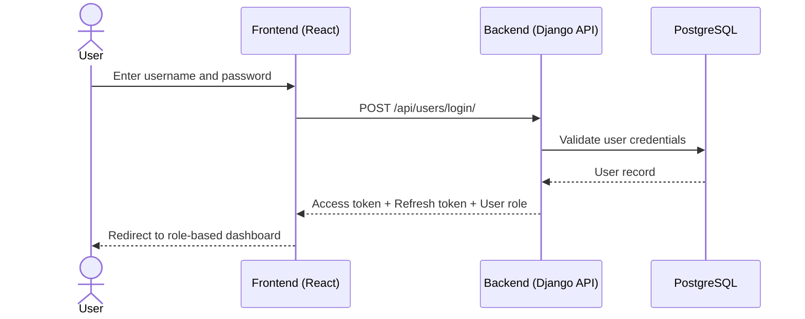
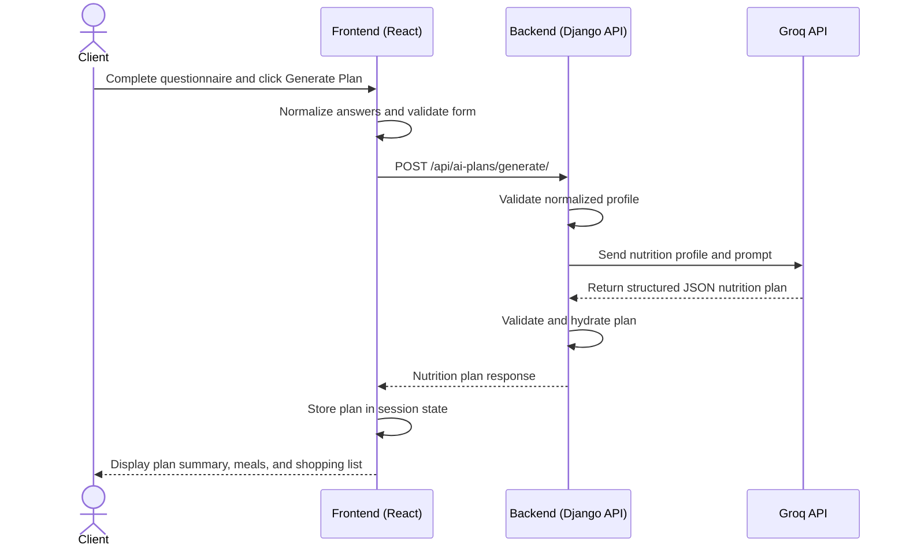
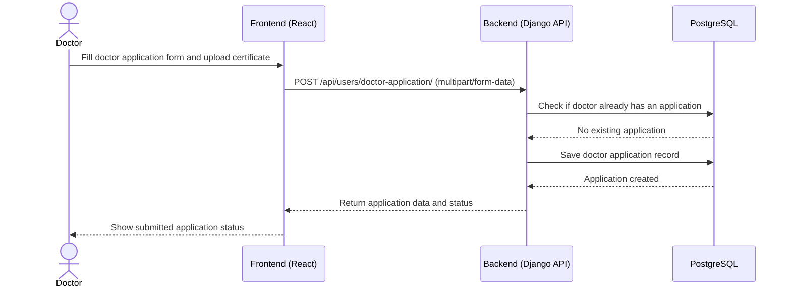

### 3. Create High-Level Sequence Diagrams

The following sequence diagrams cover three critical MVP interactions in the Data Diet system.

#### 3.1 User Login Flow

#### 3.2 Client Generates an AI Nutrition Plan

#### 3.3 Doctor Submits Application

