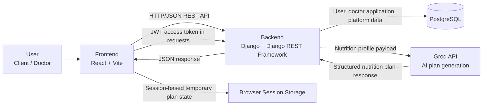
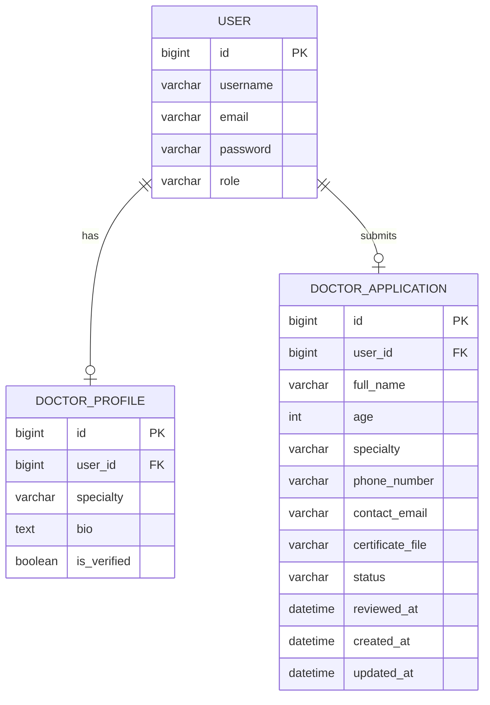
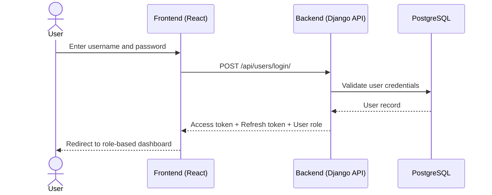
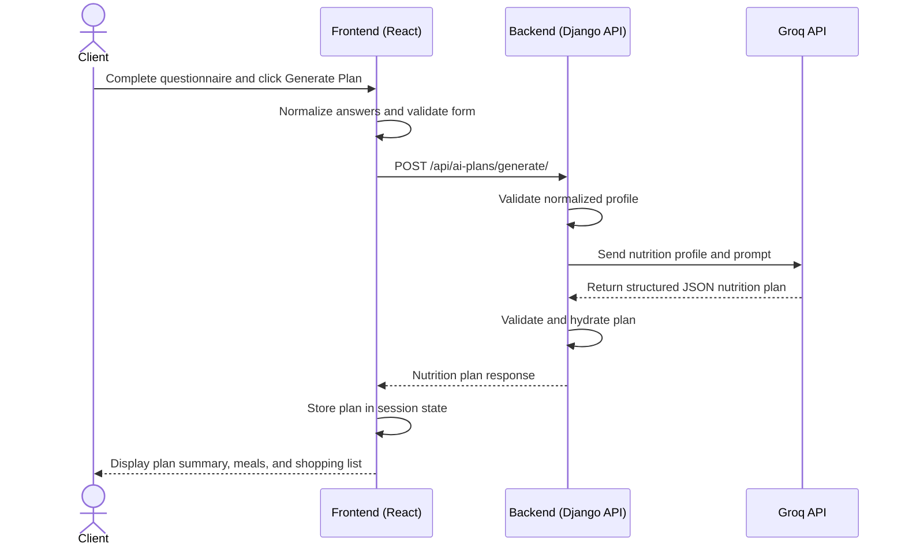
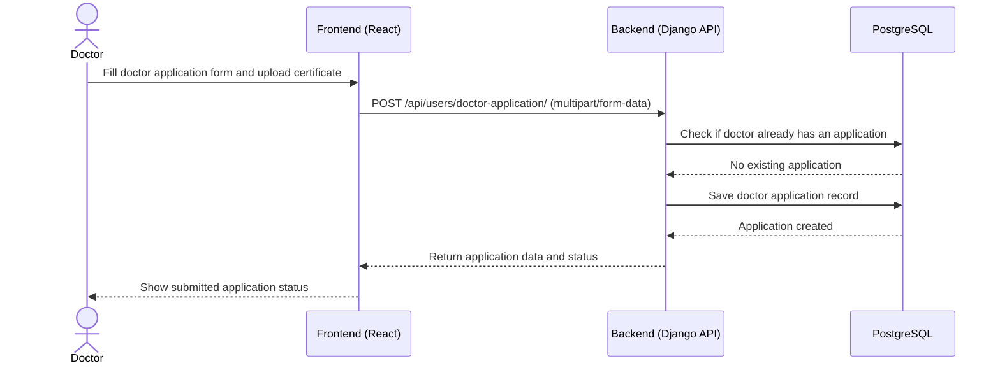

# 0. Define User Stories and Mockups

## Prioritized User Stories

### Must Have

* As a visitor, I want to register as either a client or a doctor, so that I can access the platform with the correct role.
* As a registered user, I want to log in securely, so that I can access my role-specific dashboard.
* As a client, I want to complete a guided nutrition questionnaire, so that the system can collect the data required to generate a personalized AI nutrition plan.
* As a client, I want to generate an AI-based nutrition plan from my questionnaire answers, so that I can receive a personalized diet structure based on my profile and goals.
* As a client, I want to review my generated plan including calories, macros, meals, and shopping list, so that I can follow the plan in a practical way.
* As a client, I want to make simple local adjustments such as:

  * replacing meals
  * replacing ingredients
  * making meals quicker
  * making them cheaper
    so that I can personalize the generated plan without requesting a new AI response.
* As a doctor, I want to submit a doctor application with my professional details and certificate file, so that the platform can review my eligibility.
* As a doctor, I want to view the current status of my submitted application, so that I know whether it is pending, approved, or rejected.
* As a client, I want to browse approved doctors and their contact details, so that I can request medical or nutrition support when needed.

---

### Should Have

* As a client, I want my AI plan session to remain available during the current browser session, so that I do not lose my questionnaire answers or generated plan while navigating.
* As a client, I want to view a lightweight history of previously generated plans, so that I can remember past plan summaries and dates.


---

### Could Have

* As a client, I want to switch the questionnaire output language preference, so that the generated plan matches my preferred language.
* As a client, I want additional assessment and support sections in my dashboard, so that I can explore more health-related platform features.
* As a doctor, I want a richer professional profile page, so that clients can better understand my background and specialty.


---


### Won’t Have (for the current MVP)

* As a client, I want to book appointments directly with doctors through the platform, so that I can manage consultations end to end.
* As a client, I want real-time chat with doctors, so that I can receive live support inside the application.
* As an administrator, I want an in-app review dashboard for doctor approval workflow, so that I can manage doctor applications from the platform interface.
* As a client, I want persistent full plan storage and retrieval from the backend, so that I can reopen complete historical plans at any time.


---


## Mockups for Main Screens

Because this MVP includes a user interface, mockups are required for the main implemented screens.

### 1. Registration Screen

* **Fields:**

  * username
  * email
  * password
  * account type
* **Purpose:**
  Create either a client or doctor account

---

### 2. Login Screen

* **Fields:**

  * username
  * password
* **Purpose:**
  Authenticate users and route them to the correct dashboard

---

### 3. Client AI Plans Screen

* Multi-step questionnaire
* Generate Plan action
* **Purpose:**
  Collect nutrition profile data and trigger AI plan generation

---

### 5. Doctor Join / Application Screen

* **Fields:**

  * full name
  * age
  * specialty
  * phone number
  * contact email
  * certificate upload
* **Purpose:**
  Submit doctor verification request

---

### 6. Medical Support Screen

* Approved doctor cards
* Contact details for each approved doctor
* **Purpose:**
  Allow clients to find verified nutrition specialists

# 1. Design System Architecture


### High-Level Architecture Diagram




## Data Flow

### 1. Authentication Flow

* The user interacts with the React frontend to register or log in.
* The frontend sends authentication requests to the Django REST backend.
* The backend validates credentials and returns JWT tokens.
* The frontend stores the authentication data locally and attaches the access token to protected API requests.

---

### 2. Role-Based Application Flow

* After login, the frontend routes the user based on role (`client` or `doctor`).
* Protected client and doctor pages communicate with the backend through authenticated REST endpoints.

---

### 3. AI Nutrition Plan Flow

* The client completes the multi-step questionnaire in the React frontend.
* The frontend normalizes the questionnaire answers and sends them to the backend AI Plans endpoint.
* The Django backend validates the submitted nutrition profile.
* The backend sends the profile to the **Groq API** for nutrition plan generation.
* Groq returns a structured plan to the backend.
* The backend returns the generated plan to the frontend.
* The frontend displays the plan and stores the current session state in browser session storage.
* Simple refinements such as:

  * replacing meals
  * replacing ingredients
  * increasing variety
  * making meals quicker or cheaper
    are handled locally in the frontend without sending another AI request.

---

### 4. Doctor Application Flow

* A doctor fills in the join form and uploads a certificate file from the frontend.
* The frontend sends a multipart form request to the Django backend.
* The backend stores application data in PostgreSQL.
* Verify doctor eligibility through system administrator.
* If the doctor is qualified, they will be added to the medical support as a doctor.
  
  ---

### 5. Medical Support Flow

* A client opens the Medical Support page in the frontend.
* The frontend requests the approved doctors list from the backend.
* The backend queries PostgreSQL and returns approved doctor records.
* The frontend displays doctor contact information to the client.

---

## Architecture Summary

* **Front-end:** React with Vite
* **Back-end:** Django + Django REST Framework
* **Authentication:** JWT via `rest_framework_simplejwt`
* **Database:** PostgreSQL
* **External Service:** Groq API for AI nutrition plan generation
* **Client-Side Temporary State:** Browser session storage for questionnaire and generated plan session


# 2. Define Components, Classes, and Database Design

## Back-End Component and Class Descriptions

### 1. User Model

* **Purpose:** Represents authenticated platform users.

* **Class:** `User`

* **Base Class:** `AbstractUser`

* **Attributes:**

  * `id`
  * `username`
  * `email`
  * `password`
  * `role` (`client` or `doctor`)

* **Key Behavior:**

  * Supports role-based access across the platform.

---

### 2. Doctor Profile Model

* **Purpose:** Stores extended doctor profile information.

* **Class:** `DoctorProfile`

* **Attributes:**

  * `id`
  * `user` (One-to-One with `User`)
  * `specialty`
  * `bio`
  * `is_verified`

* **Key Behavior:**

  * Intended to represent a verified doctor profile.

* **Note:**

  * This model exists in the backend but is not currently used by the active doctor application flow.

---

### 3. Doctor Application Model

* **Purpose:** Stores doctor onboarding requests submitted through the platform.

* **Class:** `DoctorApplication`

* **Attributes:**

  * `id`
  * `user` (One-to-One with `User`)
  * `full_name`
  * `age`
  * `specialty`
  * `phone_number`
  * `contact_email`
  * `certificate_file`
  * `status` (`pending`, `approved`, `rejected`)
  * `reviewed_at`
  * `created_at`
  * `updated_at`

* **Key Behavior:**

  * Tracks the doctor verification lifecycle.

---

## Back-End API and Service Classes

### 4. RegisterView

* **Purpose:** Handles user registration.
* **Methods:**

  * `post()` creates a new user through `UserSerializer`.

---

### 5. LoginView

* **Purpose:** Authenticates users and returns JWT tokens.
* **Methods:**

  * `post()` validates credentials and returns `access`, `refresh`, and basic user data.

---

### 6. CurrentUserView

* **Purpose:** Returns the currently authenticated user.
* **Methods:**

  * `get_object()` returns `request.user`.

---

### 7. DoctorApplicationView

* **Purpose:** Handles doctor application submission and retrieval.

* **Methods:**

  * `get_queryset()` returns the current user’s application
  * `get()` fetches the current application
  * `post()` creates a new application with uploaded certificate

---

### 8. ApprovedDoctorListView

* **Purpose:** Lists approved doctors for clients.
* **Methods:**

  * `get_queryset()` returns doctor applications with `status='approved'`

---

### 9. GenerateAiPlanView

* **Purpose:** Accepts a normalized nutrition profile and returns an AI-generated nutrition plan.

* **Methods:**

  * `post()` validates input, checks API key availability, requests a plan from Groq, validates the returned plan, and sends it back to the client

---

### 10. Permission Classes

* **`IsDoctorUser`**

  * Restricts access to authenticated users with role `doctor`

* **`IsClientUser`**

  * Restricts access to authenticated users with role `client`

---

## Back-End Serializers

### 11. UserSerializer

* **Purpose:** Validates and creates users.
* **Fields:** `id`, `username`, `email`, `password`, `role`
* **Key Method:** `create()`

---

### 12. CurrentUserSerializer

* **Purpose:** Returns authenticated user profile data.
* **Fields:** `id`, `username`, `email`, `role`

---

### 13. DoctorApplicationSerializer

* **Purpose:** Validates and serializes doctor application records.
* **Fields:** application fields plus `certificate_file_url`
* **Key Method:** `get_certificate_file_url()`

---

### 14. ApprovedDoctorSerializer

* **Purpose:** Returns approved doctor data to clients.
* **Fields:** `id`, `username`, `full_name`, `specialty`, `phone_number`, `contact_email`

---

## Back-End AI Service Functions

### 15. `request_nutrition_plan(profile)`

* Sends the normalized client profile to the Groq API and returns a validated JSON nutrition plan.

### 16. `build_system_prompt()`

* Builds the system-level prompt that defines the expected nutrition plan JSON structure.

### 17. `build_user_prompt(profile)`

* Builds the user prompt using the submitted client profile.

### 18. `validate_normalized_profile(profile)`

* Ensures the incoming AI profile payload contains all required sections and key fields.

### 19. `validate_generated_plan(plan)`

* Ensures the generated plan includes required keys and at least one day.

### 20. `hydrate_generated_plan(plan)`

* Adds optional plan fields such as:

  * `shopping_list`
  * `plan_tags`
  * `fallback_message`
    if missing.

---

## Front-End Main Components and Interactions

### 1. AuthProvider / AuthContext

* Manages authentication state, session restoration, login, logout, and registration.
* Interacts with auth services and browser storage.

---

### 2. AppRoutes

* Defines application navigation.
* Routes users into public, client, and doctor sections.

---

### 3. ProtectedRoute / GuestRoute

* Enforces route access control based on authentication and role.

---

### 4. DashboardShell

* Shared dashboard layout for protected areas.
* Hosts sidebar navigation, workspace area, and sign-out controls.

---

### 5. LoginScreen

* Collects username and password.
* Calls authentication logic and redirects by role.

---

### 6. RegisterScreen

* Collects account data and selected role.
* Creates a new client or doctor account.

---

### 7. AiPlansWorkspace

* Main orchestration component for the client AI plan journey.

* Maintains:

  * questionnaire answers
  * current step
  * generated plan
  * validation state
  * local plan edits

* Interacts with:

  * `AiPlanQuestionnaire`
  * `NutritionPlanView`
  * AI plan service
  * local validation utilities
  * session storage

---

### 8. AiPlanQuestionnaire

* Renders the multi-step nutrition intake form dynamically from configuration.
* Sends input updates and navigation actions back to `AiPlansWorkspace`.

---

### 9. NutritionPlanView

* Displays generated nutrition plan data:

  * daily calories
  * macros
  * meals
  * substitutions
  * shopping list
  * plan tags

* Triggers local plan-editing actions without another backend call.

---

### 10. DoctorJoinPage

* Displays doctor application form or submitted application status.
* Uploads certificate files through multipart requests.

---

### 11. ClientMedicalSupportPage

* Fetches and displays approved doctors from the backend.

---

### 12. ClientPlansHistoryPage

* Displays a lightweight history view.
* Currently uses static sample data on the front end rather than persisted backend records.

---

## Database Design

The project uses a **relational database (PostgreSQL)**.

---

### Entity Relationship Diagram



---

## Relational Schema

### Table: `users_user`

* `id` – Primary key
* `username` – Required
* `email` – Required in current registration flow
* `password` – Required
* `role` – Required, default is `client`

---

### Table: `users_doctorprofile`

* `id` – Primary key
* `user_id` – One-to-one foreign key to `users_user`
* `specialty` – Required
* `bio` – Required
* `is_verified` – Default `false`

---

### Table: `users_doctorapplication`

* `id` – Primary key
* `user_id` – One-to-one foreign key to `users_user`
* `full_name` – Required
* `age` – Required
* `specialty` – Required
* `phone_number` – Required
* `contact_email` – Required
* `certificate_file` – Required
* `status` – Default `pending`
* `reviewed_at` – Optional
* `created_at` – Auto-generated
* `updated_at` – Auto-generated

---

## Non-Persistent AI Plan Data Structure

The generated nutrition plan is **not currently stored in the database**. It is returned from the backend and handled in the frontend session.

---

### Normalized AI Profile Payload

```json
{
  "profile": {},
  "goal": {},
  "activity": {},
  "health": {},
  "preferences": {},
  "behavior": {},
  "output_preferences": {}
}
```


### Generated Nutrition Plan Structure

```json
{
  "summary": {
    "daily_calories": 0,
    "daily_macros": {
      "protein_g": 0,
      "carbs_g": 0,
      "fat_g": 0
    },
    "plan_goal": "string"
  },
  "days": [],
  "shopping_list": [],
  "plan_tags": [],
  "fallback_message": ""
}
```

# 3. Create High-Level Sequence Diagrams

The following sequence diagrams cover three critical MVP interactions in the Data Diet system.

#### 3.1 User Login Flow



#### 3.2 Client Generates an AI Nutrition Plan



#### 3.3 Doctor Submits Application



# 4. Document External and Internal APIs

#### External APIs

**1. Groq API**
- **Purpose:** Generates personalized nutrition plans from the normalized client profile.
- **Why it was chosen:** It supports fast LLM inference and returns structured JSON through a chat-completions style API, which fits the project’s AI nutrition-plan workflow.
- **Used by:** Django backend only
- **Endpoint used by the project:** `https://api.groq.com/openai/v1/chat/completions`

---

#### Internal API Endpoints

| URL Path | Method | Input Format | Output Format | Description |
|---|---|---|---|---|
| `/api/users/register/` | `POST` | JSON | JSON | Registers a new user as `client` or `doctor` |
| `/api/users/login/` | `POST` | JSON | JSON | Authenticates user and returns tokens plus user info |
| `/api/users/me/` | `GET` | Authorization header (`Bearer token`) | JSON | Returns the current authenticated user |
| `/api/users/doctor-application/` | `GET` | Authorization header | JSON | Returns the current doctor’s submitted application |
| `/api/users/doctor-application/` | `POST` | `multipart/form-data` | JSON | Submits a new doctor application with certificate upload |
| `/api/users/approved-doctors/` | `GET` | Authorization header | JSON | Returns approved doctors for client medical support |
| `/api/ai-plans/generate/` | `POST` | JSON | JSON | Generates a nutrition plan from a normalized client profile |
| `/api/token/` | `POST` | JSON | JSON | Returns JWT access and refresh tokens |
| `/api/token/refresh/` | `POST` | JSON | JSON | Returns a new JWT access token using a refresh token |

---

#### Endpoint Details

**1. Register User**
- **URL:** `/api/users/register/`
- **Method:** `POST`
- **Input:** JSON

```json
{
  "username": "sara",
  "email": "sara@example.com",
  "password": "StrongPass123",
  "role": "client"
}
```

- **Output:** JSON

```json
{
  "user": {
    "id": 1,
    "username": "sara",
    "email": "sara@example.com",
    "role": "client"
  },
  "message": "User registered successfully!"
}
```

---

**2. Login User**
- **URL:** `/api/users/login/`
- **Method:** `POST`
- **Input:** JSON

```json
{
  "username": "sara",
  "password": "StrongPass123"
}
```

- **Output:** JSON

```json
{
  "refresh": "jwt_refresh_token",
  "access": "jwt_access_token",
  "user": {
    "id": 1,
    "username": "sara",
    "email": "sara@example.com",
    "role": "client"
  },
  "message": "Login successful"
}
```

---

**3. Obtain JWT Token Pair**
- **URL:** `/api/token/`
- **Method:** `POST`
- **Input:** JSON

```json
{
  "username": "sara",
  "password": "StrongPass123"
}
```

- **Output:** JSON

```json
{
  "refresh": "jwt_refresh_token",
  "access": "jwt_access_token"
}
```

**Note:** This is the authentication endpoint currently used by the frontend login service.

---

**4. Refresh JWT Access Token**
- **URL:** `/api/token/refresh/`
- **Method:** `POST`
- **Input:** JSON

```json
{
  "refresh": "jwt_refresh_token"
}
```

- **Output:** JSON

```json
{
  "access": "new_jwt_access_token"
}
```

---

**5. Get Current User**
- **URL:** `/api/users/me/`
- **Method:** `GET`
- **Input:** Authorization header
- **Output:** JSON

```json
{
  "id": 1,
  "username": "sara",
  "email": "sara@example.com",
  "role": "client"
}
```

---

**6. Submit Doctor Application**
- **URL:** `/api/users/doctor-application/`
- **Method:** `POST`
- **Input:** `multipart/form-data`

**Form Fields**
- `full_name`
- `age`
- `specialty`
- `phone_number`
- `contact_email`
- `certificate_file`

- **Output:** JSON

```json
{
  "id": 4,
  "full_name": "Dr. Ahmad Ali",
  "age": 38,
  "specialty": "Clinical Nutrition",
  "phone_number": "+966500000000",
  "contact_email": "doctor@example.com",
  "certificate_file": "doctor_certificates/file.pdf",
  "certificate_file_url": "http://localhost:8000/media/doctor_certificates/file.pdf",
  "status": "pending",
  "reviewed_at": null,
  "created_at": "2026-04-17T12:00:00Z",
  "updated_at": "2026-04-17T12:00:00Z"
}
```

---

**7. Get Doctor Application Status**
- **URL:** `/api/users/doctor-application/`
- **Method:** `GET`
- **Input:** Authorization header
- **Output:** JSON

```json
{
  "id": 4,
  "full_name": "Dr. Ahmad Ali",
  "age": 38,
  "specialty": "Clinical Nutrition",
  "phone_number": "+966500000000",
  "contact_email": "doctor@example.com",
  "certificate_file_url": "http://localhost:8000/media/doctor_certificates/file.pdf",
  "status": "pending",
  "reviewed_at": null,
  "created_at": "2026-04-17T12:00:00Z",
  "updated_at": "2026-04-17T12:00:00Z"
}
```

---

**8. Get Approved Doctors**
- **URL:** `/api/users/approved-doctors/`
- **Method:** `GET`
- **Input:** Authorization header
- **Output:** JSON array

```json
[
  {
    "id": 4,
    "username": "doctor1",
    "full_name": "Dr. Ahmad Ali",
    "specialty": "Clinical Nutrition",
    "phone_number": "+966500000000",
    "contact_email": "doctor@example.com"
  }
]
```

---

**9. Generate AI Nutrition Plan**
- **URL:** `/api/ai-plans/generate/`
- **Method:** `POST`
- **Input:** JSON

```json
{
  "profile": {
    "age": 28,
    "weight_kg": 70,
    "height_cm": 165,
    "sex": "female"
  },
  "goal": {
    "type": "weight_loss",
    "pace": "moderate"
  },
  "activity": {
    "level": "moderate"
  },
  "health": {},
  "preferences": {},
  "behavior": {},
  "output_preferences": {
    "language": "en"
  }
}
```

- **Output:** JSON

```json
{
  "summary": {
    "daily_calories": 1800,
    "daily_macros": {
      "protein_g": 130,
      "carbs_g": 170,
      "fat_g": 60
    },
    "plan_goal": "weight_loss"
  },
  "days": [
    {
      "day_number": 1,
      "title": "Day 1",
      "meals": []
    }
  ],
  "shopping_list": [
    "Chicken breast",
    "Oats",
    "Greek yogurt"
  ],
  "plan_tags": [
    "high_protein",
    "balanced"
  ],
  "fallback_message": ""
}
```
# 5. Plan SCM and QA Strategies

#### SCM Strategy

The project should use **Git** as the source control management tool, with a simple branch structure that supports ongoing MVP development and safe integration.

**Branching Strategy**

* `main`: production-ready code only
* `Dev`: integration branch for completed features before production release
* `Husaam-dev`, `Omar-dev`, `Mohammed-dev`, `Ali-dev`: developer branches used for implementing features, fixing bugs, and handling urgent production issues

**SCM Process**

* Each new feature or bug fix should be developed in its own branch.
* Developers should make small, regular commits with clear messages.
* All completed work should be submitted through a **Pull Request** into `Dev`.
* Pull Requests should be reviewed before merging.
* After validation in `Dev`, stable increments should be merged into `main`.

**Code Review Rules**

* Reviewers should verify:

  * correctness of business logic
  * API contract consistency between React and Django
  * role-based access control for `client` and `doctor`
  * input validation and error handling
  * no sensitive configuration values are hardcoded in production code
  * Pull Requests should not be merged without at least one review.

---

#### QA Strategy

The QA approach for this MVP should combine **manual testing**, **API testing**, **unit testing**, and **basic build validation**.

**1. Front-End QA**

* **Linting Tool:** ESLint
* **Current validation available:** `npm run lint`
* **Recommended tests:**

  * component tests for authentication screens
  * component tests for AI questionnaire flow
  * component tests for nutrition plan rendering and local edit actions
* **Recommended tools:**

  * React Testing Library
  * Vitest or Jest

**2. Back-End QA**

* **Current framework:** Django test framework is available, but automated tests are still minimal
* **Recommended tests:**

  * unit tests for serializers and permission classes
  * unit tests for AI profile validation and generated plan validation
  * integration tests for:

    * registration
    * login
    * current user endpoint
    * doctor application submission
    * approved doctors retrieval
    * AI plan generation endpoint
* **Recommended tools:**

  * Django `TestCase`
  * Django REST Framework API test tools
  * Postman for manual API verification

**3. Manual Testing for Critical User Flows**
The following flows should be tested manually in every major release:

* client registration and login
* doctor registration and login
* doctor application submission with file upload
* client AI questionnaire completion
* AI nutrition plan generation
* local meal/ingredient replacement actions
* approved doctor listing in Medical Support
* token expiry and refresh behavior

**4. API Testing**

* Use **Postman** to validate request/response behavior for all backend endpoints.
* Maintain a Postman collection for:

  * authentication endpoints
  * doctor application endpoints
  * AI plan generation endpoint

**5. Build and Deployment Validation**

* Frontend:

  * run `npm run lint`
  * run `npm run build`
* Backend:

  * run Django tests
  * verify migrations
  * verify environment variables such as database configuration and `GROQ_API_KEY`

---

#### Deployment Pipeline Plan

The project should use two environments:

**Staging**

* Used for integration testing before production
* Deployed from `Dev`
* Validates end-to-end flows with real backend/frontend integration

**Production**

* Used for final release
* Deployed only from `main`
* Requires successful review and staging validation before release

**Recommended Pipeline Stages**

1. Pull latest branch
2. Install dependencies
3. Run frontend linting
4. Run frontend build
5. Run backend tests
6. Apply database migrations
7. Deploy to staging or production based on branch

---

#### Summary

**SCM**

* Git-based workflow
* `main`, `Dev`, developer branches
* Pull requests and code review required before merge

**QA**

* ESLint for frontend quality checks
* Django test framework for backend validation
* Postman for API verification
* Manual testing for critical MVP user journeys
* Staging before production deployment
