# 0. Define User Stories and Mockups

## Prioritized User Stories

### Must Have

* As a visitor, I want to register as either a client or a doctor, so that I can access the platform with the correct role.
* As a registered user, I want to log in securely, so that I can access my role-specific dashboard.
* As an authenticated user, I want the system to identify my role and route me to the correct protected dashboard, so that I can access the features available to me.
* As a client, I want to complete a guided nutrition questionnaire, so that the system can collect the data required to generate a personalized AI nutrition plan.
* As a client, I want to generate an AI-based nutrition plan from my questionnaire answers, so that I can receive a personalized diet structure based on my profile and goals.
* As a client, I want my generated nutrition plan to be saved automatically in my account, so that I can review it again later.
* As a client, I want to review my generated plan including calories, macros, meals, and shopping list, so that I can follow the plan in a practical way.
* As a client, I want to view my previously saved nutrition plans, so that I can reopen complete historical plans at any time.
* As a client, I want to make simple local adjustments such as replacing meals, replacing ingredients, making meals quicker, and making them cheaper, so that I can personalize the generated plan without requesting a new AI response.
* As a doctor, I want to submit a doctor application with my professional details and certificate file, so that the platform can review my eligibility.
* As a doctor, I want to view the current status of my submitted application, so that I know whether it is pending, approved, or rejected.
* As a client, I want to browse approved doctors and their contact details, so that I can request medical or nutrition support when needed.

---

### Should Have

* As a client, I want my AI plan session to remain available during the current browser session, so that I do not lose my questionnaire answers or generated plan while navigating.
* As an authenticated user, I want the system to restore my session when possible, so that I can continue using the platform without logging in again after every refresh.
* As a client, I want to view a lightweight summary of my saved plans before opening one in full, so that I can quickly find the plan I need.

---

### Could Have

* As a client, I want to switch the questionnaire output language preference, so that the generated plan matches my preferred language.
* As a client, I want additional assessment and support sections in my dashboard, so that I can explore more health-related platform features.
* As a doctor, I want a richer professional profile page, so that clients can better understand my background and specialty.
* As an administrator, I want a dedicated in-app review dashboard for doctor approvals, so that I can manage doctor applications without relying only on the Django admin panel.

---

### Won’t Have (for the current MVP)

* As a client, I want to book appointments directly with doctors through the platform, so that I can manage consultations end to end.
* As a client, I want real-time chat with doctors, so that I can receive live support inside the application.
* As a doctor, I want to manage consultation schedules and patient bookings, so that I can handle appointments through the platform.
* As a client, I want online payment for consultations or subscriptions, so that I can complete transactions inside the system.


---


## Mockups for Main Screens

Because this MVP includes a user interface, mockups are required for the main implemented screens.

Here is the link to the "Figma" design:

https://www.figma.com/design/TwldpP4c4unvN9YMYzmZMB/DataDiet?node-id=0-1&t=gkbNPOIwerDzZuyb-1


---

# 1. Design System Architecture


### High-Level Architecture Diagram

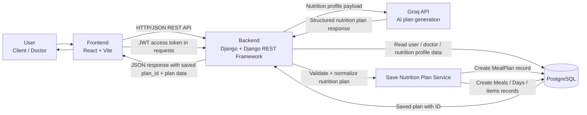


---


## Data Flow

### 1. Authentication Flow

* The user interacts with the React frontend to register or log in.
* The frontend sends authentication requests to the Django REST backend.
* For login, the frontend obtains JWT tokens from the backend and then requests the current user profile.
* The backend validates credentials and returns access and refresh tokens.
* The frontend stores authentication data locally and attaches the access token to protected API requests.
* When needed, the frontend uses the refresh token to request a new access token.

---

### 2. Role-Based Application Flow

* After login, the frontend retrieves the authenticated user profile and determines the user role (`client` or `doctor`).
* The frontend routes the user to the correct protected dashboard based on role.
* Protected client and doctor pages communicate with the backend through authenticated REST endpoints.

---

### 3. AI Nutrition Plan Flow

* The client completes the multi-step questionnaire in the React frontend.
* The frontend normalizes the questionnaire answers and sends them to the backend AI Plans endpoint.
* The Django backend validates the submitted nutrition profile.
* The backend sends the profile to the **Groq API** for nutrition plan generation.
* Groq returns a structured plan to the backend.
* The backend saves the generated plan and profile snapshot in PostgreSQL.
* The backend returns the generated plan and saved plan metadata to the frontend.
* The frontend displays the plan and stores the current session state in browser session storage.
* Simple refinements such as replacing meals, replacing ingredients, increasing variety, and making meals quicker or cheaper are handled locally in the frontend without sending another AI request.

---

### 4. Doctor Application Flow

* A doctor fills in the join form and uploads a certificate file from the frontend.
* The frontend sends a multipart form request to the Django backend.
* The backend stores the doctor application data in PostgreSQL.
* A system administrator reviews the submitted application and certificate.
* If approved, the application status is updated to `approved`.
* Approved doctor records then become available in the client Medical Support section.

---

### 5. Medical Support Flow

* A client opens the Medical Support page in the frontend.
* The frontend requests the approved doctors list from the backend.
* The backend queries PostgreSQL for doctor applications with approved status.
* The backend returns the approved doctor records to the frontend.
* The frontend displays doctor contact information to the client.

---

## Architecture Summary

* **Front-end:** React with Vite
* **Back-end:** Django + Django REST Framework
* **Authentication:** JWT via `rest_framework_simplejwt`
* **Database:** PostgreSQL
* **External Service:** Groq API for AI nutrition plan generation
* **Persistent Plan Storage:** Generated nutrition plans are stored in PostgreSQL
* **Client-Side Temporary State:** Browser session storage for questionnaire progress and the current generated plan session

---


# 2. Define Components, Classes, and Database Design

## Back-End Component and Class Descriptions


1. Authentication Classes

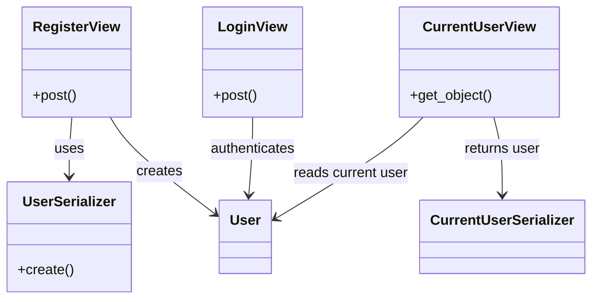

2. Doctor Application Classes


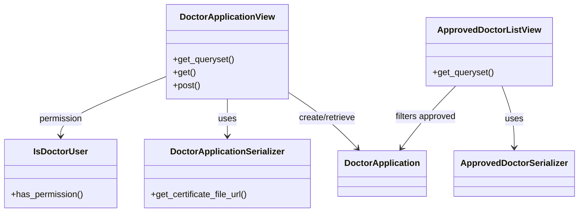

3. AI Plan Generation Classes

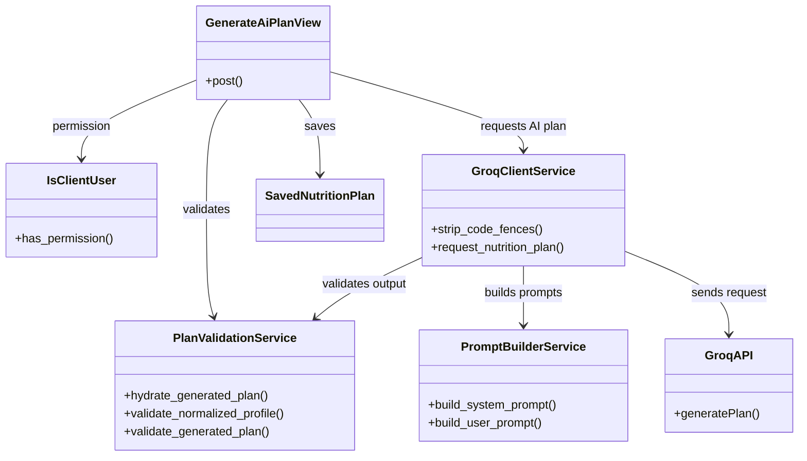

4. Saved Nutrition Plans Classes

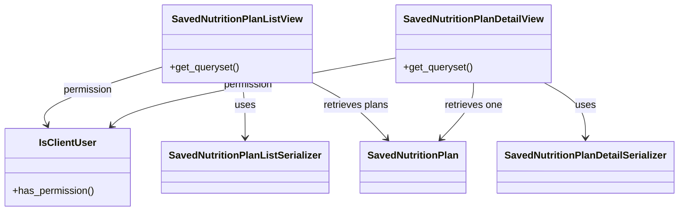

---

## Front-End Main Components and Interactions

### 1. AuthProvider / AuthContext

* Manages authentication state, session restoration, login, logout, and registration actions.
* Interacts with auth services and browser storage.

---

### 2. AppRoutes

* Defines application navigation.
* Routes users into public, client, and doctor sections.

---

### 3. ProtectedRoute / GuestRoute

* Enforces route access control based on authentication and role.

---

### 4. DashboardShell

* Shared dashboard layout for protected areas.
* Hosts sidebar navigation, workspace area, and sign-out controls.

---

### 5. LoginScreen

* Collects username and password.
* Calls authentication logic and redirects by role.

---

### 6. RegisterScreen

* Collects account data and selected role.
* Creates a new client or doctor account.

---

### 7. AiPlansWorkspace

* Main orchestration component for the client AI plan journey.
* Maintains:
  * questionnaire answers
  * current step
  * generated plan
  * validation state
  * local plan edits
  * saved plan metadata
* Interacts with:
  * `AiPlanQuestionnaire`
  * `NutritionPlanView`
  * AI plan service
  * local validation utilities
  * session storage

---

### 8. AiPlanQuestionnaire

* Renders the multi-step nutrition intake form dynamically from configuration.
* Sends input updates and navigation actions back to `AiPlansWorkspace`.

---

### 9. NutritionPlanView

* Displays generated nutrition plan data:
  * daily calories
  * macros
  * meals
  * substitutions
  * shopping list
  * plan tags
* Triggers local plan-editing actions without another backend call.

---

### 10. DoctorJoinPage

* Displays doctor application form or submitted application status.
* Uploads certificate files through multipart requests.

---

### 11. ClientMedicalSupportPage

* Fetches and displays approved doctors from the backend.

---

### 12. ClientPlansHistoryPage

* Fetches the user's saved plans from the backend.
* Displays plan summaries and allows opening a persisted saved plan in read-only mode.

---

## Database Design

The project uses a **relational database (PostgreSQL)**.

---

### Entity Relationship Diagram

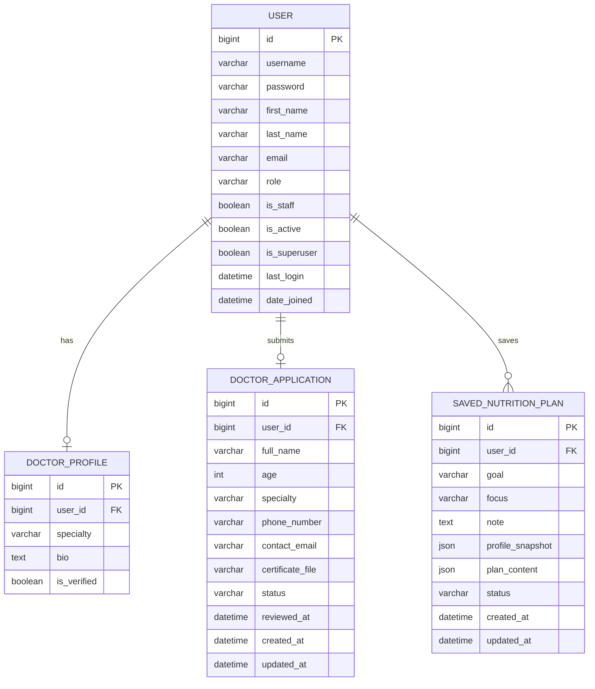

---


## Persistent AI Plan Data Structure

The generated nutrition plan is currently stored in the database after generation.

The backend persists:
- the normalized client profile as `profile_snapshot`
- the generated nutrition plan as `plan_content`
- summary metadata such as goal, focus, note, status, and timestamps

---

### Normalized AI Profile Payload

```json
{
  "profile": {},
  "goal": {},
  "activity": {},
  "health": {},
  "preferences": {},
  "behavior": {},
  "output_preferences": {}
}
```
### Generated Nutrition Plan Structure

```json
{
  "summary": {
    "daily_calories": 0,
    "daily_macros": {
      "protein_g": 0,
      "carbs_g": 0,
      "fat_g": 0
    },
    "plan_goal": "string"
  },
  "days": [],
  "shopping_list": [],
  "plan_tags": [],
  "fallback_message": ""
}
```

# 3. Create High-Level Sequence Diagrams

The following sequence diagrams cover three critical MVP interactions in the Data Diet system.

#### 3.1 User Login Flow

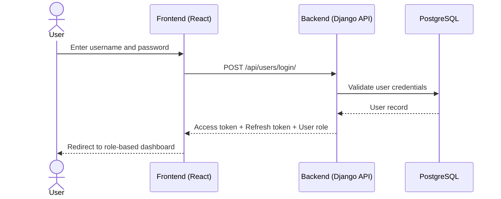

#### 3.2 Client Generates an AI Nutrition Plan

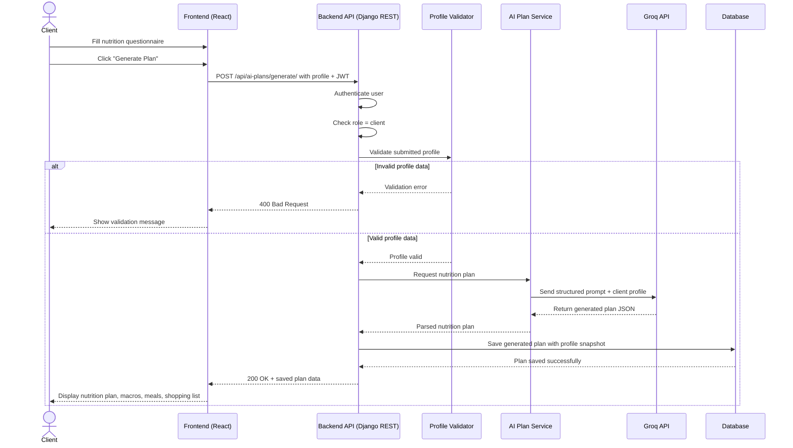


#### 3.3 Doctor Submits Application

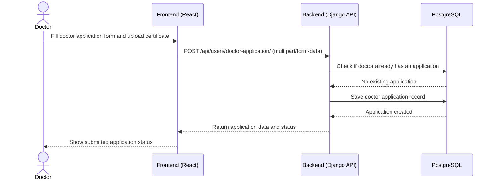

### 4.4 Acceptance of the Doctor's Request

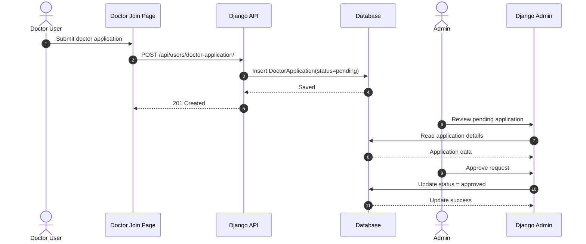

### 5.5 Displaying Approved Doctors to Clients

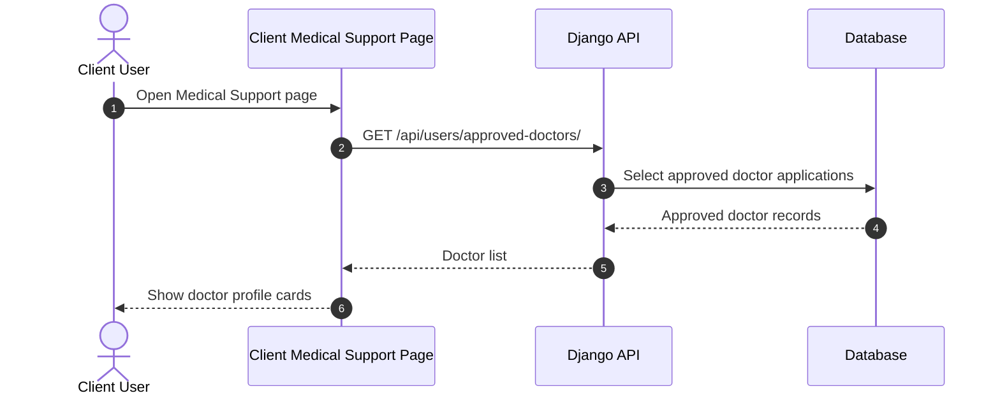

# 4. Document External and Internal APIs

#### External APIs

**1. Groq API**
- **Purpose:** Generates personalized nutrition plans from the normalized client profile.
- **Why it was chosen:** It supports fast LLM inference and returns structured JSON through a chat-completions style API, which fits the project’s AI nutrition-plan workflow.
- **Used by:** Django backend only
- **Endpoint used by the project:** `https://api.groq.com/openai/v1/chat/completions`

---

#### Internal API Endpoints

| URL Path | Method | Input Format | Output Format | Description |
|---|---|---|---|---|
| `/api/users/register/` | `POST` | JSON | JSON | Registers a new user as `client` or `doctor` |
| `/api/users/login/` | `POST` | JSON | JSON | Authenticates user and returns tokens plus user info |
| `/api/users/me/` | `GET` | Authorization header (`Bearer token`) | JSON | Returns the current authenticated user |
| `/api/users/doctor-application/` | `GET` | Authorization header | JSON | Returns the current doctor’s submitted application |
| `/api/users/doctor-application/` | `POST` | `multipart/form-data` | JSON | Submits a new doctor application with certificate upload |
| `/api/users/approved-doctors/` | `GET` | Authorization header | JSON | Returns approved doctors for client medical support |
| `/api/ai-plans/generate/` | `POST` | JSON | JSON | Generates a nutrition plan from a normalized client profile |
| `/api/token/` | `POST` | JSON | JSON | Returns JWT access and refresh tokens |
| `/api/token/refresh/` | `POST` | JSON | JSON | Returns a new JWT access token using a refresh token |

---

#### Endpoint Details

**1. Register User**
- **URL:** `/api/users/register/`
- **Method:** `POST`
- **Input:** JSON

```json
{
  "username": "sara",
  "email": "sara@example.com",
  "password": "StrongPass123",
  "role": "client"
}
```

- **Output:** JSON

```json
{
  "user": {
    "id": 1,
    "username": "sara",
    "email": "sara@example.com",
    "role": "client"
  },
  "message": "User registered successfully!"
}
```

---

**2. Login User**
- **URL:** `/api/users/login/`
- **Method:** `POST`
- **Input:** JSON

```json
{
  "username": "sara",
  "password": "StrongPass123"
}
```

- **Output:** JSON

```json
{
  "refresh": "jwt_refresh_token",
  "access": "jwt_access_token",
  "user": {
    "id": 1,
    "username": "sara",
    "email": "sara@example.com",
    "role": "client"
  },
  "message": "Login successful"
}
```

---

**3. Obtain JWT Token Pair**
- **URL:** `/api/token/`
- **Method:** `POST`
- **Input:** JSON

```json
{
  "username": "sara",
  "password": "StrongPass123"
}
```

- **Output:** JSON

```json
{
  "refresh": "jwt_refresh_token",
  "access": "jwt_access_token"
}
```

**Note:** This is the authentication endpoint currently used by the frontend login service.

---

**4. Refresh JWT Access Token**
- **URL:** `/api/token/refresh/`
- **Method:** `POST`
- **Input:** JSON

```json
{
  "refresh": "jwt_refresh_token"
}
```

- **Output:** JSON

```json
{
  "access": "new_jwt_access_token"
}
```

---

**5. Get Current User**
- **URL:** `/api/users/me/`
- **Method:** `GET`
- **Input:** Authorization header
- **Output:** JSON

```json
{
  "id": 1,
  "username": "sara",
  "email": "sara@example.com",
  "role": "client"
}
```

---

**6. Submit Doctor Application**
- **URL:** `/api/users/doctor-application/`
- **Method:** `POST`
- **Input:** `multipart/form-data`

**Form Fields**
- `full_name`
- `age`
- `specialty`
- `phone_number`
- `contact_email`
- `certificate_file`

- **Output:** JSON

```json
{
  "id": 4,
  "full_name": "Dr. Ahmad Ali",
  "age": 38,
  "specialty": "Clinical Nutrition",
  "phone_number": "+966500000000",
  "contact_email": "doctor@example.com",
  "certificate_file": "doctor_certificates/file.pdf",
  "certificate_file_url": "http://localhost:8000/media/doctor_certificates/file.pdf",
  "status": "pending",
  "reviewed_at": null,
  "created_at": "2026-04-17T12:00:00Z",
  "updated_at": "2026-04-17T12:00:00Z"
}
```

---

**7. Get Doctor Application Status**
- **URL:** `/api/users/doctor-application/`
- **Method:** `GET`
- **Input:** Authorization header
- **Output:** JSON

```json
{
  "id": 4,
  "full_name": "Dr. Ahmad Ali",
  "age": 38,
  "specialty": "Clinical Nutrition",
  "phone_number": "+966500000000",
  "contact_email": "doctor@example.com",
  "certificate_file_url": "http://localhost:8000/media/doctor_certificates/file.pdf",
  "status": "pending",
  "reviewed_at": null,
  "created_at": "2026-04-17T12:00:00Z",
  "updated_at": "2026-04-17T12:00:00Z"
}
```

---

**8. Get Approved Doctors**
- **URL:** `/api/users/approved-doctors/`
- **Method:** `GET`
- **Input:** Authorization header
- **Output:** JSON array

```json
[
  {
    "id": 4,
    "username": "doctor1",
    "full_name": "Dr. Ahmad Ali",
    "specialty": "Clinical Nutrition",
    "phone_number": "+966500000000",
    "contact_email": "doctor@example.com"
  }
]
```

---

**9. Generate AI Nutrition Plan**
- **URL:** `/api/ai-plans/generate/`
- **Method:** `POST`
- **Input:** JSON

```json
{
  "profile": {
    "age": 28,
    "weight_kg": 70,
    "height_cm": 165,
    "sex": "female"
  },
  "goal": {
    "type": "weight_loss",
    "pace": "moderate"
  },
  "activity": {
    "level": "moderate"
  },
  "health": {},
  "preferences": {},
  "behavior": {},
  "output_preferences": {
    "language": "en"
  }
}
```

- **Output:** JSON

```json
{
  "summary": {
    "daily_calories": 1800,
    "daily_macros": {
      "protein_g": 130,
      "carbs_g": 170,
      "fat_g": 60
    },
    "plan_goal": "weight_loss"
  },
  "days": [
    {
      "day_number": 1,
      "title": "Day 1",
      "meals": []
    }
  ],
  "shopping_list": [
    "Chicken breast",
    "Oats",
    "Greek yogurt"
  ],
  "plan_tags": [
    "high_protein",
    "balanced"
  ],
  "fallback_message": ""
}
```
---

### 5. Plan SCM and QA Strategies

This section defines how source code will be managed throughout development and how software quality will be maintained before release. The project will use GitHub for source code management, with a structured branching model to organize feature development, integration, testing, and production release. Quality assurance will be supported through a combination of backend testing, frontend testing, API validation, and manual verification of key user flows.

#### SCM Strategy

The project will use **Git** and **GitHub** as the main Source Code Management (SCM) tools. A clear branching strategy will be followed so that development remains organized and stable. The `main` branch will contain only production-ready code, while the `dev` branch will be used as the main integration branch for completed features before they are prepared for production. Each major feature or module will be developed in its own branch and merged into `dev` only after review and testing.

All team members are expected to make regular commits with clear commit messages that describe the purpose of the change. Before merging any feature branch, a **pull request** should be opened so the code can be reviewed by another team member. This helps detect issues early, improves consistency, and ensures that only reviewed code enters the shared branches.

| Part of Project | Suggested Branch Name | Purpose |
|---|---|---|
| Production branch | `main` | Production-ready code only |
| Development integration branch | `dev` | Integration branch for completed features before production release |
| Authentication and user registration/login | `feature/auth-system` | Develop user registration, login, JWT authentication, and current user retrieval |
| User roles and route protection | `feature/role-based-access` | Implement `client` and `doctor` role separation and protected routes |
| Doctor application workflow | `feature/doctor-application` | Develop doctor application submission, certificate upload, and application status tracking |
| Doctor approval and admin management | `feature/doctor-approval-admin` | Implement doctor approval and rejection logic and connect it to admin management |
| Approved doctors listing for clients | `feature/approved-doctors-list` | Develop the approved doctors display in the client interface |
| Doctor profile management | `feature/doctor-profile` | Develop the doctor profile model and profile-related data handling |
| AI nutrition plan generation | `feature/ai-nutrition-plans` | Implement Groq integration and AI-based nutrition plan generation |
| AI validation and prompt handling | `feature/ai-plan-validation` | Develop client data validation and prompt-building logic |
| Client dashboard pages | `feature/client-dashboard` | Develop client pages such as Home, About, and Medical Support |
| Doctor dashboard pages | `feature/doctor-dashboard` | Develop doctor pages and doctor workspace flows |
| Shared frontend UI/components | `feature/frontend-shared-components` | Develop shared UI components and common styling |
| API integration in frontend | `feature/frontend-api-integration` | Implement `axios`, token handling, and request integration in the frontend |
| Database and models | `feature/database-models` | Develop database schema, relationships, and migrations |
| Documentation | `docs/technical-documentation` | Write ERD, sequence diagrams, API documentation, and technical documentation |
| Testing | `feature/testing` | Add backend and frontend testing |
| Deployment and environment setup | `chore/deployment-setup` | Prepare environment configuration and deployment setup |

#### SCM Process

The SCM process for this project will follow these steps:

1. Developers create a separate feature branch for each task or module.
2. Changes are committed regularly with meaningful commit messages.
3. When a feature is completed, a pull request is submitted to merge it into the `dev` branch.
4. The code is reviewed by another team member before approval.
5. After integration testing is completed successfully in `dev`, stable code is merged into `main`.

This workflow supports collaborative development, reduces merge conflicts, and protects the production branch from unstable changes.

#### QA Strategy

The QA strategy will combine **automated testing** and **manual testing** to ensure the application works correctly across both backend and frontend components.

For the backend, testing should focus on critical API endpoints such as registration, login, doctor application submission, approved doctor retrieval, and AI nutrition plan generation. These tests help verify that business logic, validation, and authentication work as expected.

For the frontend, manual and component-level testing should be applied to verify important user flows such as:
- Client registration and login
- Doctor registration and application submission
- Admin approval workflow
- Display of approved doctors in the client medical support page
- AI nutrition plan generation

#### QA Testing Types

The following testing types should be included:

- **Unit Testing:** To test individual functions, serializers, validators, and frontend components.
- **Integration Testing:** To test communication between frontend and backend and verify API workflows.
- **Manual Testing:** To validate key user journeys and confirm that the UI behaves correctly.
- **End-to-End Testing:** For complete real-life flows such as registering, applying as a doctor, approving the application, and showing the approved doctor in the client interface.

#### QA Tools

The following tools are suitable for the project:

- **Postman:** For testing and verifying backend API endpoints manually
- **Jest:** For frontend unit and component testing
- **Django Test Framework / Python test tools:** For backend unit and integration testing
- **Browser-based manual testing:** For checking navigation, forms, dashboard flows, and UI behavior

#### Deployment Pipeline

The deployment process should include at least two environments:

- **Staging Environment:** Used for testing integrated features before release
- **Production Environment:** Used for the final stable version of the system

The expected pipeline is:

1. Developers complete features in their own branches.
2. Reviewed features are merged into `dev`.
3. The `dev` branch is deployed to a staging environment for testing.
4. After successful QA checks, the stable version is merged into `main`.
5. The `main` branch is deployed to production.

This deployment flow reduces risk and ensures that production releases are tested before going live.

#### Summary

In summary, the project will use a structured Git branching model with `main`, `dev`, and feature branches to manage development safely and efficiently. Code reviews and pull requests will be used before merging. Quality assurance will rely on unit testing, integration testing, end-to-end testing, and manual testing using tools such as Postman, Jest, and Django testing utilities. A staging-to-production deployment pipeline will be followed to maintain software stability and release confidence.


---


### Technical Justifications

This section explains the rationale behind the main technical choices made in the Data Diet project, including the selected technologies, architecture, and implementation approach.

#### 1. Frontend: React + Vite
React was chosen for the frontend because it supports building reusable UI components and organizing the interface into clear role-based pages for clients and doctors. This fits the project well since the platform contains multiple dashboards, protected routes, and separate user journeys.

Vite was selected as the frontend build tool because it provides a fast development experience, quick startup time, and simple configuration. This helped the team move faster during MVP development and reduced setup complexity compared with heavier frontend tooling.

#### 2. Backend: Django + Django REST Framework
Django was chosen because it offers a strong and structured backend foundation with built-in authentication, admin tools, ORM support, and secure development patterns. For this project, Django reduced the amount of boilerplate needed for user management and model-based development.

Django REST Framework was used because the system is designed as an API-driven application, where the frontend and backend are separated. DRF made it easier to build JSON endpoints, handle validation through serializers, apply permissions, and keep the API structure maintainable.

#### 3. Database Design: Relational Model
A relational database approach was chosen because the project data has clear entity relationships, such as users, doctor applications, and doctor profiles. These relationships are structured and predictable, making a relational model more suitable than a schema-less alternative.

This design also supports data integrity through one-to-one relationships and controlled status values such as `pending`, `approved`, and `rejected`, which are important for the doctor approval workflow.

#### 4. PostgreSQL
PostgreSQL was selected as the main database because it is reliable, production-ready, and well-supported by Django. It is a strong choice for structured application data and supports future scaling better than lightweight local databases.

Although an SQLite file exists in the repository for development history or local testing, the active project configuration uses PostgreSQL because it is more appropriate for real application deployment and multi-user environments.

#### 5. Custom User Model
A custom `User` model was used instead of Django’s default user model so that role management could be built directly into the authentication system. Since the platform distinguishes between `client` and `doctor`, adding a `role` field at the model level simplified authorization, routing, and dashboard separation.

This decision also makes the system easier to extend later if more user roles or profile variations are introduced.

#### 6. JWT Authentication
JWT authentication was selected because the frontend is a separate single-page application that communicates with the backend through APIs. Token-based authentication is more suitable than session-based authentication in this architecture because it works cleanly with SPA clients and protected API requests.

Using SimpleJWT also reduced implementation effort by providing a standard and secure mechanism for issuing access and refresh tokens.

#### 7. Role-Based Access Control
Role-based access control was implemented because not all users are allowed to access the same features. Clients can generate nutrition plans and browse approved doctors, while doctors can submit applications and access doctor-specific pages.

This design improves security, prevents misuse of endpoints, and keeps the user experience focused on the correct workflow for each account type.

#### 8. Doctor Application Workflow
The doctor approval process was designed as a separate application workflow rather than allowing all doctor-role users to appear immediately in the client interface. This decision was made to preserve trust and quality control in the platform.

By requiring doctors to submit professional details and a certificate file, the system ensures that only reviewed and approved doctors are listed in the medical support section. This is especially important in a health-related system where credibility matters.

#### 9. Django Admin for Approval Management
Django Admin was used for managing doctor approvals because it provides a fast and practical administrative interface without requiring the team to build a custom admin dashboard during the MVP stage.

This was a justified design choice for the current project scope because it allowed the team to focus development effort on core client and doctor features while still maintaining manual review capability.

#### 10. AI Integration Through Groq API
The Groq API was chosen for AI nutrition-plan generation because the project needed an external large language model service capable of processing user profile data and returning structured output quickly.

This was preferable to training or hosting a custom AI model because it significantly reduced development complexity, infrastructure cost, and implementation time. It also allowed the project to focus on application logic and validation rather than model operations.

#### 11. Validation Before AI Requests
The backend validates the normalized client profile before sending it to the AI service. This design was chosen to improve reliability and reduce invalid requests sent to the external API.

It also helps ensure that the generated nutrition plan is based on complete and well-formed data, which improves output quality and protects the system from malformed client input.

#### 12. Separation Between AI Logic and Core User Management
The project separates user management features into the `users` app and AI-related plan generation into the `ai_plans` app. This modular structure was chosen to improve maintainability and keep responsibilities clear.

This makes the codebase easier to understand, test, and extend. For example, authentication changes can be handled in one module, while AI prompt building and plan validation remain isolated in another.

#### 13. File Upload Support for Certificates
`multipart/form-data` was used for doctor application submission because the workflow requires uploading a certificate file. This format is the correct and practical choice when sending both form fields and files in a single request.

This design supports the administrative verification process and aligns with the system’s trust and approval requirements.

#### 14. API-First Architecture
The system was designed around internal REST APIs because the frontend and backend are separated. This architecture improves flexibility, supports clean integration between components, and makes future expansion easier, such as adding a mobile app or another client interface.

It also improves maintainability by keeping frontend presentation logic independent from backend business logic and database access.

#### 15. MVP-Oriented Design Decisions
Several technical choices were made with MVP delivery in mind. Examples include using Django Admin instead of a custom internal approval dashboard, integrating an external AI API instead of building a proprietary model pipeline, and keeping the domain model intentionally small.

These decisions were justified because they allowed the team to deliver the essential product features quickly while keeping the codebase structured enough for future enhancement.
